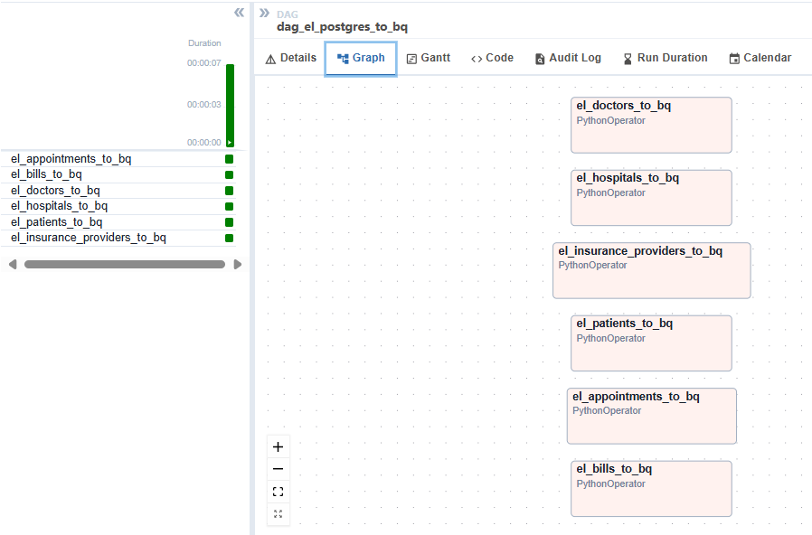

# 🏥 Healthcare Data Pipeline
Proyek ini membangun pipeline data end-to-end untuk sistem healthcare yang mencakup database PostgreSQL, orkestrasi dengan Apache Airflow, dan penyimpanan di BigQuery.

## Fitur Utama
- Inisialisasi database PostgreSQL dengan skema dan data dummy.
- Orkestrasi proses ETL menggunakan Apache Airflow.
- Sinkronisasi ke BigQuery, termasuk pembuatan tabel dengan skema JSON.
- Dukungan partisi waktu di tabel BigQuery.
- Modular dan dapat diperluas.

## Arsitektur
```
┌────────────────┐
│ Apache Airflow |
└────────────────┘
    |    ┌────────────┐
    |    │  .sql/.json│
    |    └────────────┘ 
    |        │
    |        ▼
    |    ┌─────────────┐     
    |    │PostgreSQL DB│      
    |    └─────────────┘      
    |        │
    |        ▼
    |    ┌────────────┐
    |    │  BigQuery  │
    |    └────────────┘    

```

## Struktur Folder
```bash
porject/
│
├── dags/
│   ├── dag_load_postgres.py             
│   ├── dag_create_bq_tables.py            
│   └── dag_el_bq.py             
│
├── sample-data/
│   ├── healthcare-schema.sql                  
│   └── healthcare-data.sql                    
│
├── scripts/
│   ├── helpers                
│   │   ├── bigquery_helper.py                 
│   │   └── postgres_helper.py                     
│   └── schemas/
│       ├── appointments_schema.json
│       ├── bills_schema.json
│       ├── doctors_schema.json
│       ├── hospitals_schema.json
│       ├── insurance_providers_schema.json
│       └── patients_schema.json               
│
├── keys/
│   └── bigquery-key.json                       
│
├── logs/
├── .env
├── docker-compose.yml
├── Dockerfile
├── requirements.txt
└── README.md
```


## Tiga DAG Utama
1. load_postgres_healthcare | `dag_load_postgres.py`    
    - Tujuan: Membuat schema dan insert data dummy ke PostgreSQL.
    - Langkah:        
       - create_healthcare_schema: menjalankan file healthcare-schema.sql       
       - insert_healthcare_data: menjalankan file healthcare-data.sql

2. create_bq_tables | `dag_create_bq_tables.py`    
    - Tujuan: Membuat tabel di BigQuery berdasarkan file JSON schema.
    - Langkah:        
        - Membaca skema dari insurance_providers_schema.json, appointments_schema.json, dll.        
        - Membuat tabel kosong di BigQuery, bisa dengan partisi waktu (created_at).

    - Catatan: JSON schema menggunakan field field_type untuk parameter bigquery.SchemaField.

3. el_postgres_to_bq | `dag_el_bq.py`
    - Tujuan: Menyalin data dari PostgreSQL ke BigQuery.
    - Langkah:
        - Mengambil data dari PostgreSQL sebagai pandas DataFrame menggunakan PostgresHook.
        - Mengirim ke BigQuery menggunakan pandas_gbq atau bigquery.Client.load_table_from_dataframe.

## Cara Menjalankan
1. Clone Repository
    ```bash
    git clone https://github.com/alfonharyos/airflow-postgres-bigquery-healthcare.git
    cd airflow-postgres-bigquery-healthcare
    ```

2. Buat file .env       
    Contoh isi .env:
    ```bash
    POSTGRES_USER=healthcare
    POSTGRES_PASSWORD=password
    POSTGRES_DB=healthcare
    POSTGRES_HOST=healthcare_db

    AIRFLOW_DB=airflow
    AIRFLOW_USER=airflow
    AIRFLOW_PASS=airflow

    BQ_PROJECT_ID=your_project_id
    BQ_DATASET_ID=healthcare_dummy
    BQ_DATASET_LOCATION=asia-southeast2
    GOOGLE_APPLICATION_CREDENTIALS=/opt/keys/bigquery-key.json
    ```
3. Jalankan Docker Compose
    ```bash
    docker compose up --build
    ```
    Tunggu hingga airflow-webserver aktif di http://localhost:8080


## Catatan Tambahan
- Pastikan kredensial BigQuery disimpan di ./keys/bigquery-key.json.

- Mengatur Airflow Connection untuk postgres_healthcare dan google_cloud_default.

- Untuk partisi waktu, tambahkan argumen partition_field='created_at' saat membuat tabel.


## Hasil
1. Airflow dags        
    

2. load_postgres_healthcare dags        
    
    
    
    helathcare table | posgre           
    

3. create_bq_tables dags        
    
    

    heathcare table | bigquery           
    

4. el_postgres_to_bq dags        
    
    
